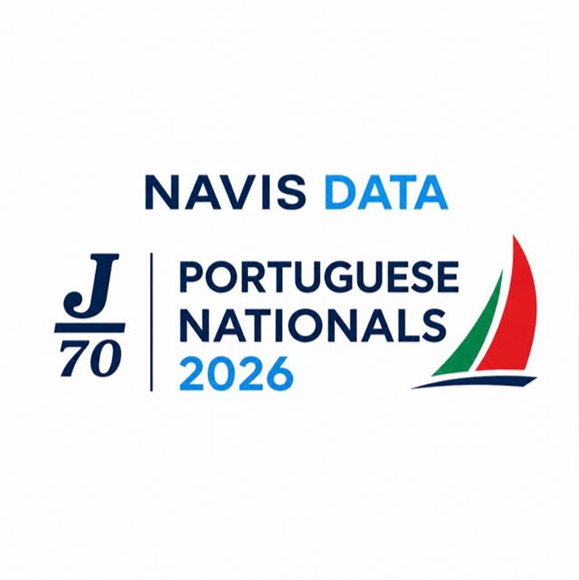

# NavisData

AI-powered performance analytics platform for competitive sailing teams

- Backend data pipelines for GPS, wind and telemetry data
- AI-driven race performance analytics
- Models integrated into production via web analytics platform

Try it for yourself!  
Check the example we provide by going to our online analytics page *[here](https://navisdata.vercel.app/)* and enter the regatta code we povide below

```
 
```
>
> Enter the race ID:
> ```
> 0123
> ```

<br>

<p align="center">
  
</p>